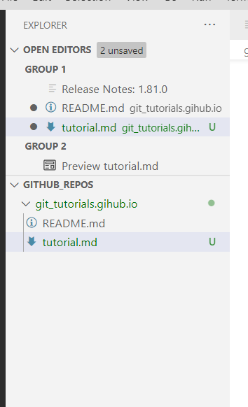

# git sdfsdf

## sdfsdfsdf
 
### sdfsdfsdf


#### dfgsdfsdfsd


# fdsfdsf
- sdfsdf
- fsdfsdf
    - sdfdsf
    - sdfsdf
- sdffds
    - dfdsf
        - fsdfsdf

`cfdsfsdf`

print("hrelo")
```
print("hello")

```



jgjhghgh